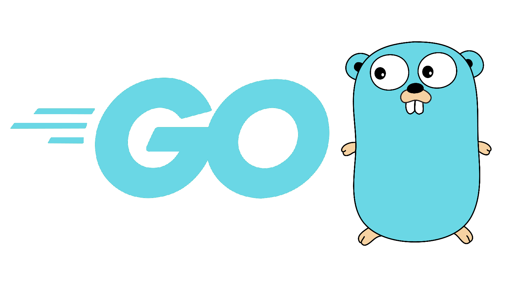
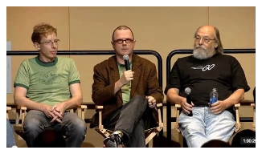

## O que é GO (Golang)
- Linguagem de programação open source que tem o objetivo de tornar os programadores mais produtivos.
- Expressiva, concisa, limpa e eficiente.
- Foi criada para aproveitar os recursos de multiprocessamento e multicore dos computadores modernos e redes de alta velocidade.
- Rápida compilação e, em simultâneo, trabalha com garbage collection.
- Rápida, estaticamente tipada, compilada, mas que, em simultâneo, parece até uma linguagem dinamicamente tipada e interpretada
- Compilada em apenas um arquivo binário, sem dependências externas.

## Onde Nasceu e quem criou?
- Google
- Começou a ser projetada em setembro de 2007
- Versão 1.0 — 2012
- Versão 1.5 — Próprio compilador foi feito em GO
- Retrocompatibilidade garantida na versão 1
- Rob Pike - UNIX & UTF-8
- Robert Griesemar -V8
- Ken Thompson - UNIX & UTF-8
- 

## O que o GO não é
- Uma linguagem de programação que resolverá todos os seus problemas
- Não é uma linguagem dinâmica
- Não é uma linguagem interpretada
- Não é uma linguagem com muitos recursos

## Quem Usa GO

# Motivação
- Limitações das principais linguagens utilizadas na Google como Python, Java e C/C++
- Python: problemas com lentidão
- C/C++: Muita complexidade e demorado para compilar
- Java: Complexidade gerada e também a verbosidade da linguagem
- Multithreading e Concorrência: Não nasceram nativamente pensando nisso
- Simplicidade
- Framework de testes e profiling nativos
- Detecção de Race conditions
- Deploy absurdamente simples
- Baixa curva de aprendizado